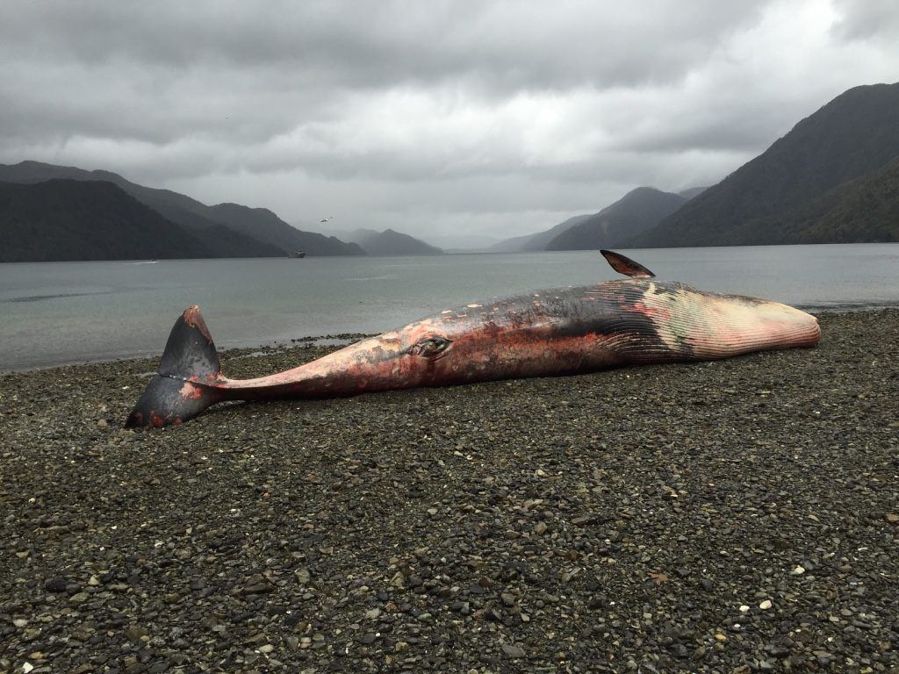
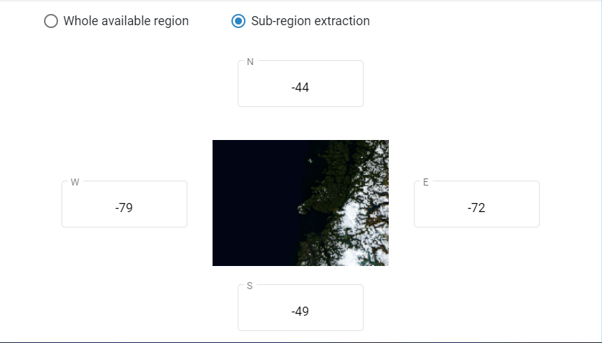
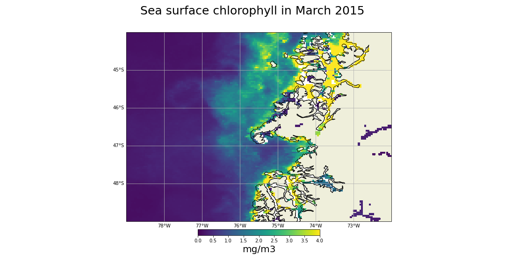
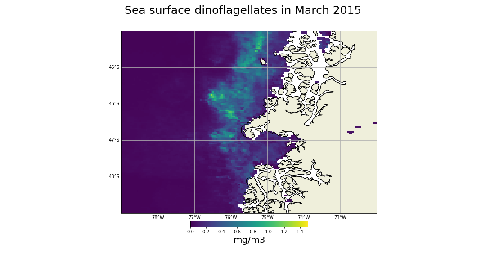
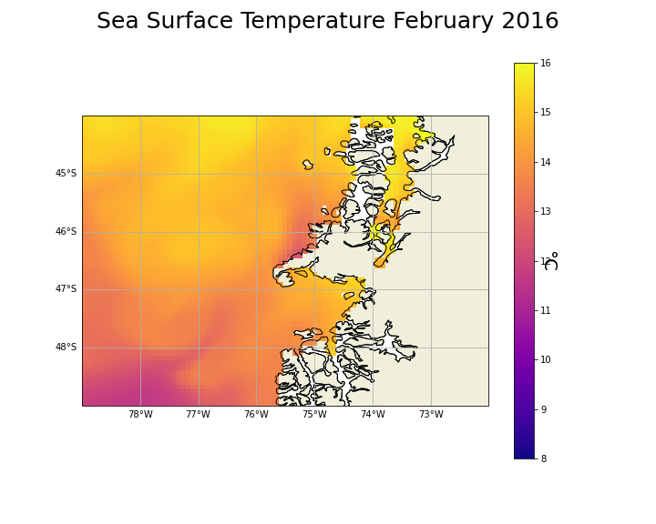
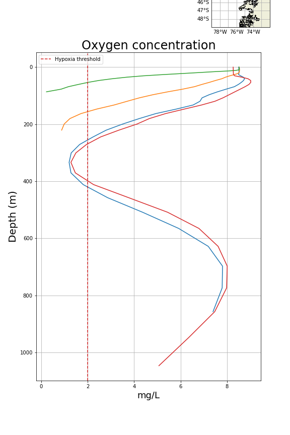
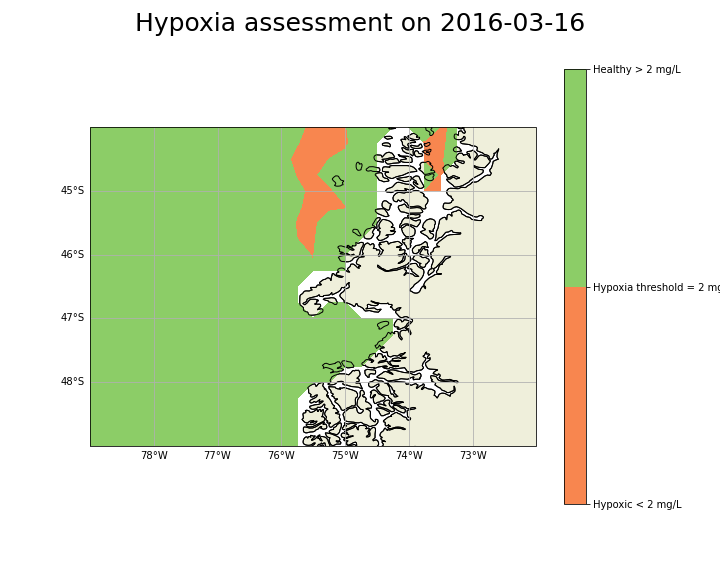
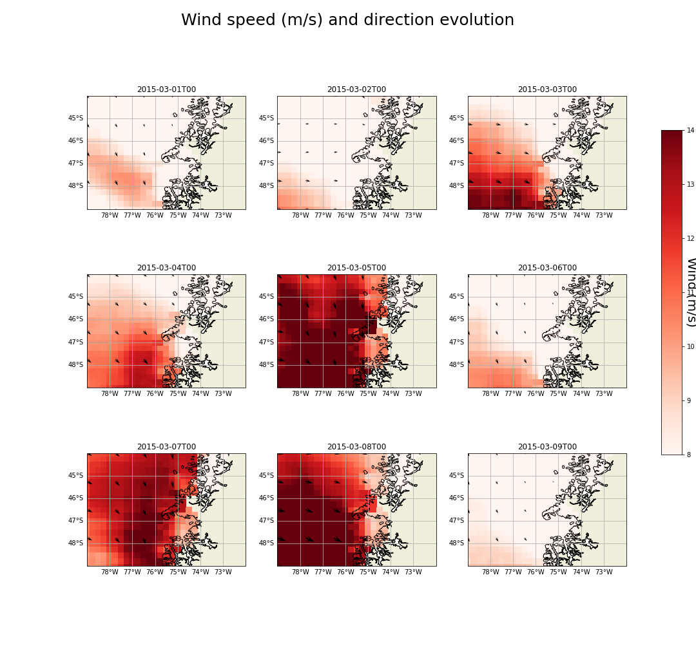
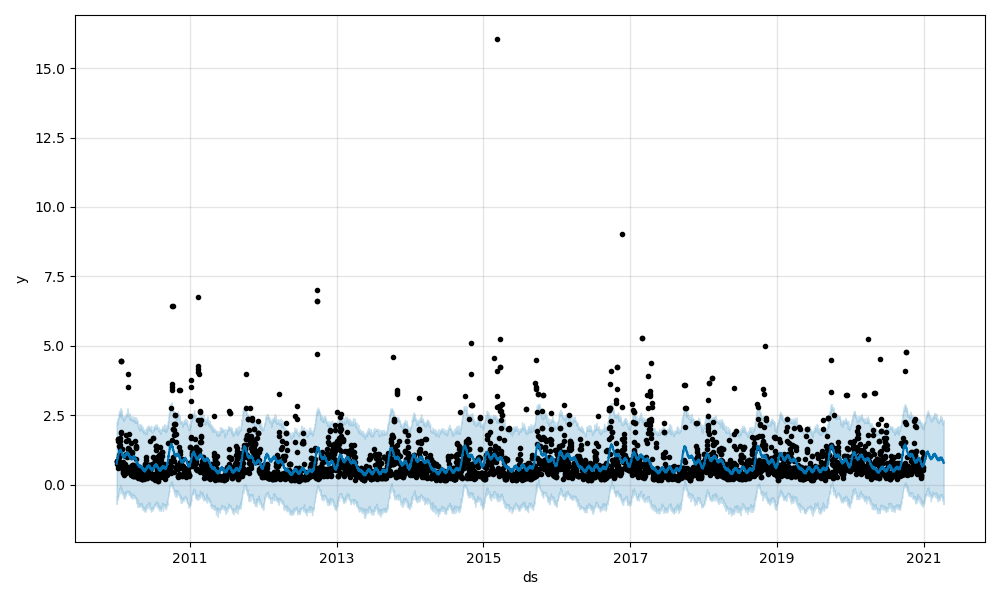

# Largest Mass Mortality in Baleen Whales

## Analysing the event with CMEMS (Copernicus Marine Service) data.

- Place: Chilean Patagonia - Golfo de Penas [-79, -72, -44, -49]
- Specie: Sei Whale (*Baleanoptera borealis*)
- Number of death Whales in one event: between 300 - 400
- Time: March 2015

### INTRO 

Mass Mortality Events (MME) are well know in tooth whales but are rare in baleen whales because usually they are not gregarius species. This social behaviour is a very strong argument to define possible causes. Harmful Algae Bloom (HAB), particularly the genus *Alexandrium* and climate phenomena such as "El Niño" are the main hypotesis for this tragic event that compromises actual and future conservation efforts of Rorquals.

### Data

From the [Copernicus Marine Service](https://marine.copernicus.eu/) dataset are download to work with Chlorophyll (CHL), Dinoflagellates (DINO), Sea Surface Temperatura (SST), Nutrient (NO3), Oxygen (O2) and Wind variables.

- **Coordinates**

- **CMEMS Products:**

- Chlorophyll (CHL) and Dinoflagellates (DINO) from the [**Global Ocean Colour (Copernicus-GlobColour), Bio-Geo-Chemical, L4 (monthly &amp; interpolated) from Satellite Observations (1997-ongoing)**](https://resources.marine.copernicus.eu/product-detail/OCEANCOLOUR_GLO_BGC_L4_MY_009_104/INFORMATION) 

- Temperature Vertical Profiles from the [**Global ocean biogeochemistry hindcast**](https://resources.marine.copernicus.eu/product-detail/GLOBAL_MULTIYEAR_BGC_001_029/INFORMATION) 

- Sea Surface Temperature (SST) from the [**Global Ocean Physics Reanalysis**](https://resources.marine.copernicus.eu/product-detail/GLOBAL_MULTIYEAR_PHY_001_030/INFORMATION)

- Oxygen and Nutrient from the [**Global ocean biogeochemistry hindcast**](https://resources.marine.copernicus.eu/product-detail/GLOBAL_MULTIYEAR_BGC_001_029/INFORMATION)

- Wind from the [**Global Ocean Wind L4 Reprocessed 6 hourly Observations**](https://resources.marine.copernicus.eu/product-detail/WIND_GLO_WIND_L4_REP_OBSERVATIONS_012_006/INFORMATION)

### Results

- Sea Surface Chlorophyll was quantified and during the first months of 2015 (when the event happened) are visible zones near the shore (feeding areas) with high concentration of algae. The evidence of Dinoflagellates (*Alexandrium sp.*) in some points with concentrations **> 1.2 mg/m3** indicate possible HAB that could affected the whales during those periods of time. 

Total Chlorophyll 

Dinoflagellates 

- Sea Surface Temperature (SST) is higher comparing other periods. High temperatures are consequence of 'El Niño' event. 
2013 - 2017 were especially hot years for the Pacific. The sea temperature oscilation (hot periods: *El Niño* - colder periods: *La Niña*) are correlated to HAB.

- Hypoxic conditions in surface and deeper waters might contribute in the negative effects of whales environment.

- Wind direction during those periods can be a variable to consider to know where the death bodies of whales were dragged.

Wind speed and direction (March-2015) 

- Daily CHL concentration 2010-2020. **Prophet** model.

